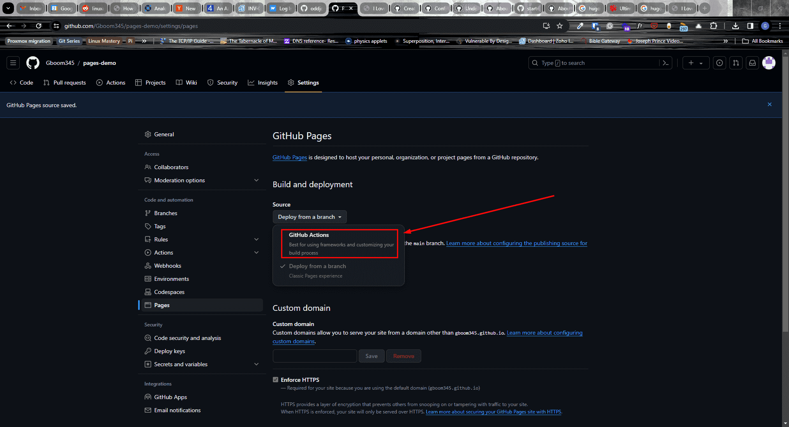

# إعداد استضافة المخالب الناعمة على GitHub Pages

المستودع: <https://github.com/nassifmhm302-beep/soft-paws-veterinary-platform>

## الإعداد المناسب لحسابك

بما أن خيار **GitHub Actions** لا يظهر في قائمة **Source** لديك، استخدم المسار البديل الذي جهزته داخل المستودع:

1. افتح صفحة إعدادات Pages:
   <https://github.com/nassifmhm302-beep/soft-paws-veterinary-platform/settings/pages>
2. من **Build and deployment**، افتح قائمة **Source**.
3. اختر **Deploy from a branch**.
4. في قائمة الفرع اختر **gh-pages**.
5. في قائمة المجلد اختر **/(root)**.
6. اضغط **Save**.
7. انتظر دقيقة أو دقيقتين، ثم افتح:
   <https://nassifmhm302-beep.github.io/soft-paws-veterinary-platform/>

> الصورة المرجعية توضح مكان قائمة **Source** داخل **Settings → Pages**. في حسابك اختر **Deploy from a branch** ثم `gh-pages` و`/(root)`.

## التحديثات المستقبلية

عند رفع أي تغيير إلى فرع `main`، سيبني GitHub Actions الموقع ويرفع الملفات الجديدة تلقائياً إلى فرع `gh-pages`. لا تعدّل فرع `gh-pages` يدوياً.

## ملاحظة عن وظائف الموقع

GitHub Pages يستضيف الواجهة الثابتة فقط. صفحات التعريف والمتجر والسلة المحلية تعمل، أما الحجز والتواصل وإرسال الطلبات فتحتاج خادماً وقاعدة بيانات حتى تُحفظ فعلياً.

المصدر الرسمي: [Configuring a publishing source for GitHub Pages](https://docs.github.com/en/pages/getting-started-with-github-pages/configuring-a-publishing-source-for-your-github-pages-site)
